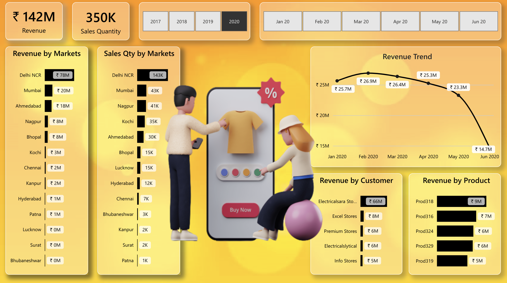

##  End-to-End Product Sales Analysis Using Microsoft Fabric 

🔗 [View the Power BI Report](https://app.powerbi.com/groups/me/reports/46123a15-23ee-4c68-93ea-da322912e771/ReportSection?experience=power-bi)

### 🎯 Project Objective
To develop a fully integrated and scalable Product Sales Analytics Dashboard using Microsoft Fabric. The project combines diverse data sources (Azure SQL DB, CSV, Excel), performs advanced transformations using Pipelines and Notebooks, and visualizes business-critical metrics such as market performance, product-wise sales, customer revenue, and sales trends — all in real-time using Power BI.

### 🧱 1. Workspace & Architecture Setup
Step 1: Fabric Workspace Creation
Created a Fabric Capacity Workspace with all essential features:

Lakehouse

Warehouse

Pipelines

Notebooks

Dataflows Gen2

### 🗂 2. Data Ingestion & Storage
Step 2: Lakehouse and Warehouse Setup
Lakehouse: Established as the core storage layer for all structured and semi-structured datasets.

Warehouse: Built for SQL-based modeling and BI access.

Step 3: Integrated Multi-Source Data
Azure SQL Database: Used Fabric Data Pipelines to ingest sales transaction data.

CSV Files: Imported market-level and product-level sales using the Load to Tables feature.

Excel Files: Ingested forecast and target data using Dataflows Gen2.

Notebook Transformation (PySpark)
One dataset required complex transformation logic (e.g., dynamic revenue adjustments or mapping region-customer hierarchies). Implemented:

Advanced joins and filtering

Grouping and window operations

Transformation chaining

Output saved into Lakehouse tables

### 🧩 3. Data Modeling
Step 4: Modeled via SQL Endpoint
Accessed Lakehouse SQL Endpoint to build relationships and logic.

Designed a star schema:

Fact Table: SalesTransactions

Dimension Tables: Customer, Product, Region, Market, Calendar

Key Measures Created
sql
Copy
Edit
Total Revenue = SUM(SalesTransactions[Revenue])
Total Quantity = SUM(SalesTransactions[Qty])
Also implemented:

YoY Growth

Target Achievement %

### 📊 4. Report Design in Power BI
Step 5: Dashboard Creation (Based on Shared Visual)
Designed an insight-driven dashboard highlighting:

High-Level KPIs
Total Revenue: ₹142M

Total Quantity Sold: 350K

Revenue by Markets
Top Market: Delhi NCR (₹78M), followed by Mumbai and Ahmedabad

Tail Markets: Surat, Lucknow, Bhubaneshwar (₹0M)

Sales Quantity by Markets
Delhi NCR leads with 143K units

Visualization reveals a strong volume-to-value trend across states

Revenue Trend (Jan 2020 – Jun 2020)
Rising trend till March (₹26.9M)

Gradual decline thereafter, reaching ₹14.7M by June

Revenue by Customer
Top Customers:

Electricalsara Stores (₹66M)

Excel Stores

Premium Stores

Revenue by Product
Top SKUs:

Prod318 (₹9M), Prod316, Prod324, Prod329, Prod319

### 🚀 5. Deployment & Insights Delivery
Step 6: Report Sharing & Real-Time Access
Published the Power BI report within the Fabric workspace using Direct Lake connectivity

Enabled real-time querying with no scheduled refreshes

Shared via role-based access to key business stakeholders

### ✅ Project Highlights
Unified Fabric tools: Pipelines, Dataflows, Notebooks, Lakehouse, Power BI

Applied both basic and complex transformations

Delivered an engaging, visual sales dashboard focused on:

Market segmentation

Product & customer profitability

Monthly revenue performance

Strategic Insights Delivered
Identified markets to invest in

Highlighted customers/products driving growth

Diagnosed sales drop regions and reasons